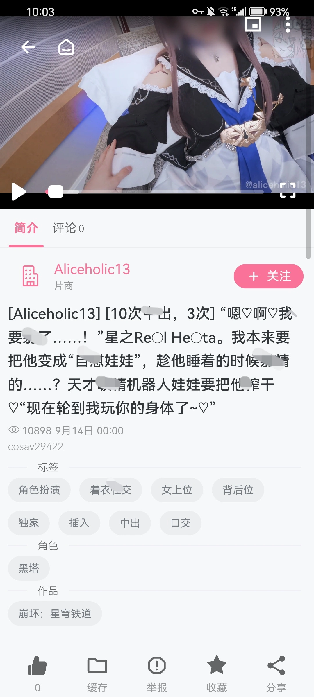
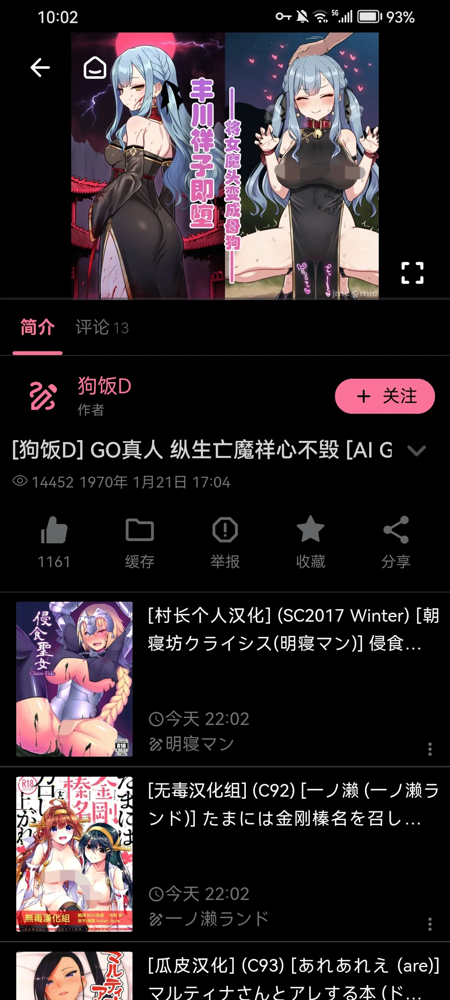
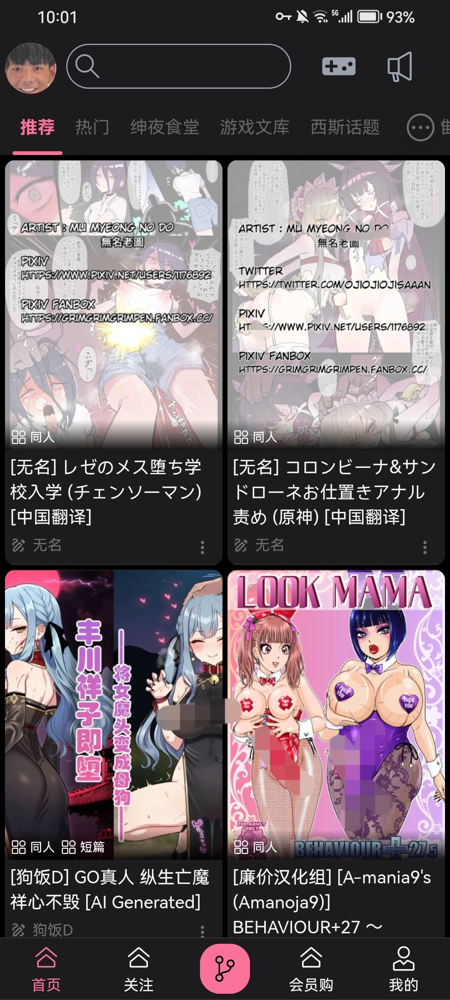
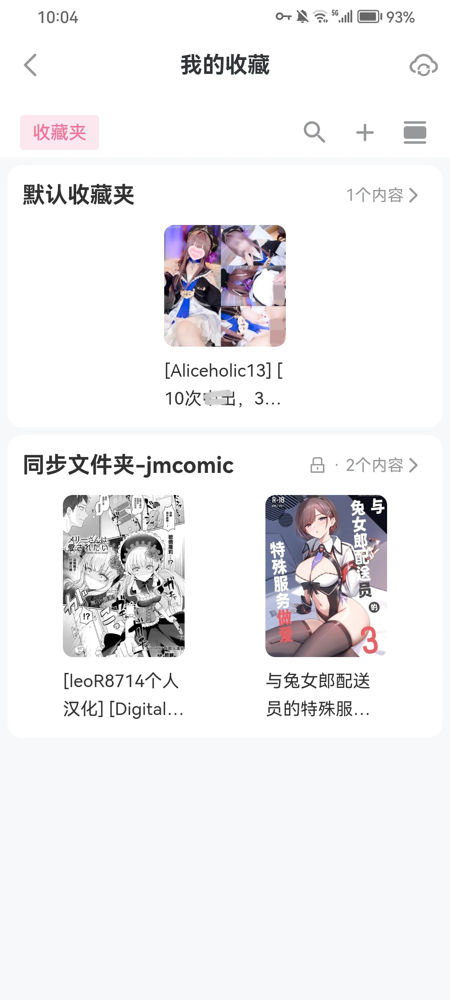
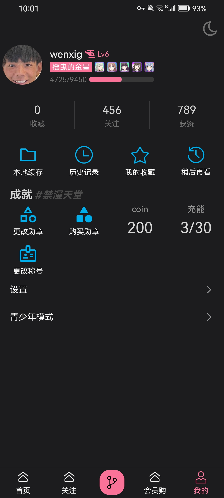

    

<h1 align="center">Delta Comic</h1>

Per Aspera, Ad Astra

    
    

---

## 特点

- 提供一个可扩展的平台，使得来源不同的资源可通过**插件**整合于单个应用
- 独立开发不易，各位喜欢的点个star吧，你们的支持就是我开发的最大动力
- 该项目仅供技术研究使用，请勿用于其他用途，下载后请与24小时内删除
- ~~_主包最近在玩嘎啦给木，更新频率稍缓_~~ (嘎啦给木太好玩了 :sob::+1:)

## 功能

- 安装插件并驱动
- 提供通用库与默认样式

## 实机演示

|  |  |  |  |  |
| :-: | :-: | :-: | :-: | :-: |

## 如何使用

### Android

  1. 安装应用
  2. 在下文所提及的插件中选择一些安装
  3. 启动

### Ios

  1. 尝试自行构建

## 现成的插件

### PicaAcg/bika/哔卡漫画

     

### Jmcomic/禁漫天堂

     

### Cosav/cos天堂

     

### E-hentai/ExHentai/EHentai(_开发中_)    

     

## 想要编写插件?

   
 该包可为你提供许多基本的数据结构, 与便捷的`definePlugin`

## Star History

## 工程路线图

- [x] bika -_何以忘却_
- [x]  jmcomic -_何以哀怮_
- [x]  cosav -_何以殁亡_
- [ ] e-hentai -_何以战栗_
- _待定_ -_何以倾慕_
- _待定_ -_无以迷惘_
- _待定_ -_无以踟蹰_
- _待定_ -_无以迁怒_
- _待定_ -_无以夸矜_
- _待定_ -_无以降神_
